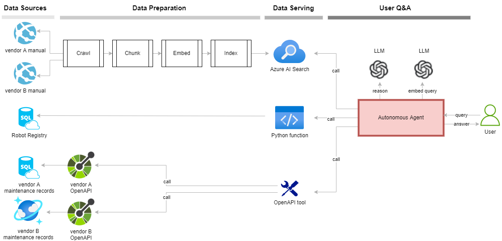

# Introduction

When a device malfunctions in the field, it's usually time consuming to troubleshoot for the root cause.
 You will need to first collect all the relevant data such as device manuals, maintenance records, and near real-time logs
 and telemetry data. You will then corelate and reason over the data to hopefully find the root cause.
 Based on the device, the data can be in different data sources, formats, or exposed in different APIs.
 Can we use generative AI to help us collect reason over the data?

In this repo, we experiment multiple approaches to learn how to use llm powered agents to query different types of data
 from different sources to help with troubleshooting.

Here's our fictitious sample use case:

* Imagine we operate a fleet of robots from multiple vendors. The robots come with different documents and APIs.
 When a robot malfunctions, we need to quickly diagnose and find the root cause.
* Assuming we have the following data for each robot:
  * manuals hosted on web sites, potentially multiple layers deep.
  * registration records in a SQL DB which include the name, purchase date, model, maker etc for each robot.
  * maintenance records, some hosted in SQL, some hosted in CosmosDB. They can be accessed through their respective OpenAPI calls.

Here's a diagram of the solution:



> Note that the [sample data](./data) is entirely mock data. Wherever Spot is mentioned, it's [BostonDynamics](https://bostondynamics.com/products/spot/)' Spot robot. Petoi belongs to [Petoi](https://www.petoi.com).

## Repo structure

```bash
├─chat
│  ├─functions # this folder contains custom functions to access data, and sample REST APIs that expose data.
│  ├─# each file represents a different approach to solve the problem.
├─chat_flow # prompt flow implemented with OpenAI Function Calling tool
├─data # sample robot registration data, manuals, maintenance data, and OpenAPI specs for different vendors.
├─eval_flow # basic evaluation with prompt flow
├─eval_langchain # basic evaluation with LangChain
├─eval_langsmith # basic evaluation with LangSmith
├─ingest # functions to ingest the sample data into Azure SQL, CosmosDB, or Azure AI Search.
├─utils # utilities to load configurations etc.
```

The [notebook](agent.ipynb) does pretty much the same thing as the code does. It just makes it a bit easier to experiment.
 If you want to run the sample yourself, you can start there.

## Experimenting with different approaches

These approaches range from relatively simple to more complex and powerful.

1. Using native OpenAI Function Calling tool - [chat_function_calling](./chat/chat_function_calling.py)
1. Using prompt flow and OpenAI Function Calling tool - [chat_flow](./chat_flow)
1. Using LangChain with static chains - [chat_langchain](./chat/chat_langchain.py)
1. Using LangChain with agent and custom tools - [chat_langchain_agent](./chat/chat_langchain_agent.py)
1. Using LangChain with agent, custom tools, and OpenAPI tool so that any functions exposed through OpenAPI spec
 can be used as an LLM tool - [chat_langchain_agent_openapi](./chat/chat_langchain_agent_openapi.py)

Also experimented with the following evaluation approaches. Note that in call cases,

* we assume a batch run against a test dataset is done separately to generate the predictions. The evaluation process doesn't generate the predictions, rather it evaluates the existing predictions against the ground truth.
* We also did not use any built-in evaluators, rather we built a very simple custom evaluator to understand how things work.

1. Evaluate using prompt flow - [eval_flow](./eval_flow/)
1. Evaluate using LangChain - [eval_langchain](./eval_langchain/). We use huggingface datasets to load the test data, drive the evaluation, and capture the outputs.
1. Evaluate using LangSmith - [eval_langsmith](./eval_langsmith/). We use LangSmith datasets to load the test data and drive the evaluation. The results are captured in LangSmith portal.

## Learnings

Here are some learnings from building this sample. There are a lot of capabilities not yet explored.
 Others may have completely different opinions.

* The point of LangChain seems to be to make it easy to build applications that provide context to LLM so LLM can interact
 with the external world, leveraging its reasoning power. OpenAI recently announced [Assistants API](https://platform.openai.com/docs/assistants/overview),
 which also seems to target similar goals. A LangChain `Agent` is similar to an OpenAI `Assistant`. They both take the user's
 input, decide on what tools to use, observe the results from the tools, and decide the next step until they solve the problem
 or are stopped.
* So if OpenAI already has these APIs, why using LangChain? I've learned the following benefits of using LangChain:
  * As seen in [chat_function_calling](./chat/chat_function_calling.py) vs [chat_langchain_agent](./chat/chat_langchain_agent.py),
   I have to write my own code to parse the LLM decision to use tools, call the tools, parse the results, and
   feed back to LLM myself when I use native OpenAI API, whereas LangChain does this automatically once I define the agent.
  * LangChain has a large community that built a rich set of tools to process data. For example, tools like [Recursive URL](https://python.langchain.com/docs/integrations/document_loaders/recursive_url) can crawl a web site to load documents. It also has many text splitters or parsers to process the documents.
  * [LangSmith](https://docs.smith.langchain.com/) logs all the intermediate steps, without any code, in a nice UI to help troubleshooting.
  * However, there's one place that I found using LangChain might be more work than worth. Initially I was using `AzureSearch` and
  `AzureSearchVectorStoreRetriever` from `langchain.vectorstores.azuresearch` as seen in [chat_langchain](./chat/chat_langchain.py).
   Not only does this rely on an older beta version of the Azure AI Search API, it's also hard to figure out how to control all the
   search parameters. It's much easier just write my own search function and make it a tool as in [chat_langchain_agent](./chat/chat_langchain_agent.py).
* The community based LangChain [OpenAPI agent](https://python.langchain.com/docs/integrations/toolkits/openapi) is amazing in that
  it makes any functionality exposed through OpenAPI an LLM tool. However, might consider write my own tool because of the following:
  * it brings in a lot of tokens because it handles all kinds of APIs. There's very little documentation. Quite difficult
  to figure out how to customize this agent to, for example, only use the GET API.
  * to use it as a tool together with other tools, you can call the `run` function of this agent's executor. But the `run` function is
  deprecated in LangChain v0.1. The new `invoke` function cannot be used this way.
* LLMs seem to require less reasoning capabilities to accomplish a goal using multi-agents vs. single-agent-multi-tools.
  With multi-agents, each agent encapsulates the logic to achieve a smaller intermediate goal, so it helps the LLM to break down complex tasks.
  A single agent provided with a lot of tools and instructions seems to have to work harder to break down complex tasks.
* When using prompt flow, here are some challenges:
  * Cannot use environment variables in `flow.dag.yaml` for things like connection name or deployment name. These are usually not inputs,
  hardcoding them makes them hard to manage.
  * Flows run from the folder where `flow.dag.yaml` is located. If you already have an application folder structure where you place
  common utilities in subfolders and run everything else from the project root, you'll have to adjust the path for module import.
  * Making the flow run in the cloud is more work, especially around creating a runtime and packaging all your code not in the flow
  folder into wheel packages. The local environment is easy to use, and provides nice UI through VSCode extension or `pf run visualize`.
  * Agent intermediate steps, including LLM inputs/output, are automatically logged and visualized nicely in the UI.
* For evaluation, prompt flow, LangChain, LangSmith all share the same concepts.
  * You can either run a test against a dataset and evaluate along the way, or you can run the test separately to generate the predictions and later evaluate the predictions in different ways without having to run the test again.
  * All frameworks have built-in evaluators that can use LLM to judge the predictions based on different criteria.
  * The basic concept of an evaluation run is to apply the evaluator against each data point in the datasets, gather the results, or further generate an aggregated score.

## What's next

There's a lot more to learn about building an LLM application and especially autonomous agent. Here are some examples.
 Of course some of these will be in its own repo.

1. Use LLM to generate real time logs and telemetry data.
1. Add real time logs and telemetry data. - Will the agent end up getting confused with too many tools? If so,
 should we have multiple agents, and have a routing agent to call each domain specific agent?
